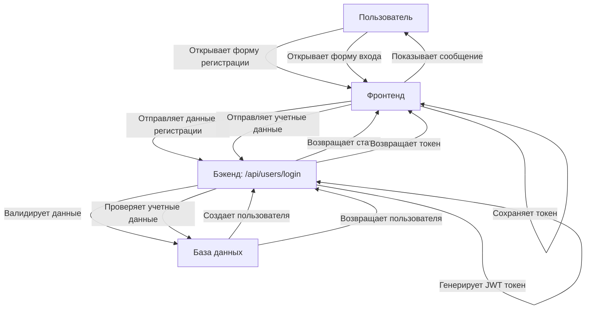

# Поток аутентификации

## Диаграмма последовательности

## Процесс регистрации
1. Пользователь заполняет форму регистрации с номером участка, именем пользователя, email и паролем
2. Фронтенд отправляет данные на `/api/users/register`
3. Бэкенд валидирует данные:
   - Номер участка уникален
   - Email уникален
   - Пароль хешируется
4. Создается запись в базе данных
5. Возвращается статус операции

## Процесс входа
1. Пользователь вводит имя пользователя и пароль
2. Фронтенд отправляет данные на `/api/users/login`
3. Бэкенд проверяет учетные данные
4. При успешной проверке генерируется JWT токен
5. Токен возвращается фронтенду для дальнейших запросов