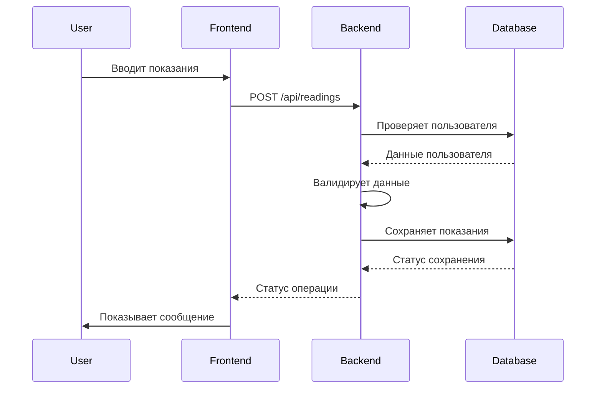

# Поток данных

## Диаграмма последовательности



## Логика сохранения

1. **Аутентификация**:
   - Проверка JWT токена
   - Извлечение user_id из токена

2. **Валидация данных**:
   - Проверка формата показаний (число с 2 знаками после запятой)
   - Проверка диапазона значений (0.00 - 99999.99)

3. **Сохранение в базе данных**:
   - Создание новой записи в таблице readings
   - Привязка к пользователю через user_id
   - Автоматическая дата и время

4. **Обработка ошибок**:
   - Ошибка валидации: 400 Bad Request
   - Ошибка аутентификации: 401 Unauthorized
   - Ошибка базы данных: 500 Internal Server Error

## Пример успешного ответа
```json
{
    "status": "success",
    "message": "Показания успешно сохранены",
    "data": {
        "id": 123,
        "day_reading": 123.45,
        "night_reading": 67.89,
        "reading_date": "2026-01-23",
        "created_at": "2026-01-23T18:21:47.913Z"
    }
}
```

## Пример ответа с ошибкой
```json
{
    "status": "error",
    "message": "Ошибка валидации",
    "errors": [
        {
            "field": "day_reading",
            "message": "Поле обязательно для заполнения"
        }
    ]
}