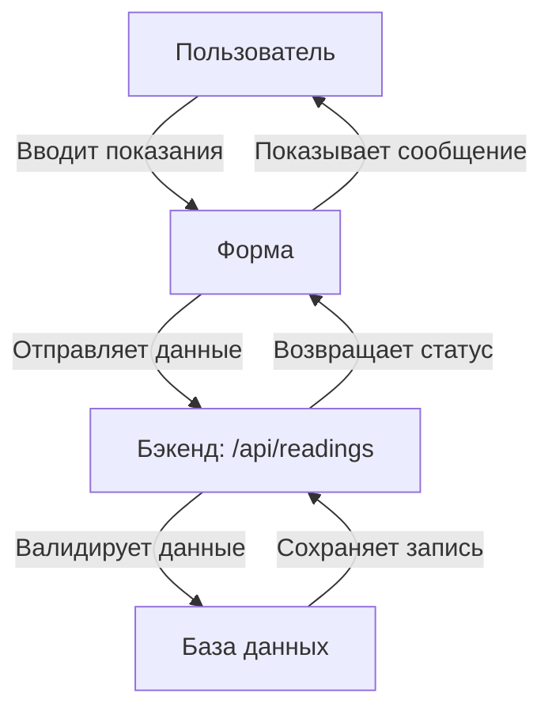

# Дизайн формы ввода показаний

## Компоненты формы

### 1. Форма ввода показаний
```
+-------------------------------------+
| Форма ввода показаний              |
+-------------------------------------+
|                                     |
| Номер участка: [12345]             |
|                                     |
| Показания день: [______] кВт·ч     |
|                                     |
| Показания ночь: [______] кВт·ч     |
|                                     |
| [Отправить]                         |
|                                     |
+-------------------------------------+
```

### 2. Сообщение о статусе
```
+-------------------------------------+
| Успех!                              |
+-------------------------------------+
|                                     |
| Показания успешно сохранены         |
|                                     |
| Дата: 23.01.2026                    |
| Время: 18:21                        |
|                                     |
+-------------------------------------+
```

## Поток данных



## Валидация данных
- Показания день: число с двумя знаками после запятой (0.00 - 99999.99)
- Показания ночь: число с двумя знаками после запятой (0.00 - 99999.99)
- Оба поля обязательны для заполнения