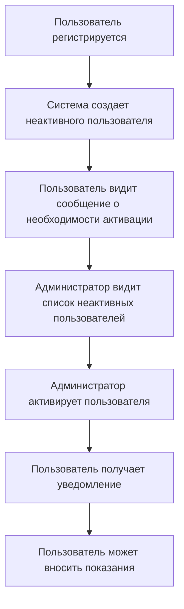

# Система ролей и активация пользователей

## Обзор

Система ролей позволяет разграничивать доступ между обычными пользователями и администраторами. Администраторы могут активировать зарегистрировавшихся пользователей, после чего те получают возможность вносить показания.

## Модели данных

### 1. Роли пользователей

```python
from enum import Enum

class UserRole(str, Enum):
    USER = "user"
    ADMIN = "admin"
```

### 2. Модель пользователя (расширенная)

```python
# core/models/user.py
from dataclasses import dataclass
from uuid import UUID
from datetime import datetime

@dataclass
class User:
    id: UUID
    plot_number: str
    username: str
    email: str
    password_hash: str
    role: UserRole = UserRole.USER
    is_active: bool = False
    created_at: datetime = datetime.now()
    activated_at: datetime | None = None
```

## Схема базы данных

```sql
-- Расширение таблицы users
ALTER TABLE users ADD COLUMN role VARCHAR(10) DEFAULT 'user';
ALTER TABLE users ADD COLUMN is_active BOOLEAN DEFAULT FALSE;
ALTER TABLE users ADD COLUMN activated_at TIMESTAMP NULL;

-- Создание таблицы для хранения запросов на активацию
CREATE TABLE activation_requests (
    id SERIAL PRIMARY KEY,
    user_id INTEGER REFERENCES users(id),
    requested_at TIMESTAMP DEFAULT CURRENT_TIMESTAMP,
    activated_at TIMESTAMP NULL,
    activated_by INTEGER REFERENCES users(id)
);
```

## Поток активации



## API для работы с ролями и активацией

### 1. Получение списка неактивных пользователей (для администраторов)
**GET** `/api/admin/users/pending`

**Headers:**
```
Authorization: Bearer <admin_token>
```

**Response:**
```json
{
    "users": [
        {
            "id": "uuid",
            "plot_number": "string",
            "username": "string",
            "email": "string",
            "registered_at": "datetime"
        }
    ]
}
```

### 2. Активация пользователя (для администраторов)
**POST** `/api/admin/users/{user_id}/activate`

**Headers:**
```
Authorization: Bearer <admin_token>
```

**Response:**
```json
{
    "status": "success",
    "message": "User activated successfully",
    "user": {
        "id": "uuid",
        "plot_number": "string",
        "username": "string",
        "activated_at": "datetime"
    }
}
```

### 3. Проверка статуса активации (для пользователей)
**GET** `/api/users/me/activation-status`

**Headers:**
```
Authorization: Bearer <user_token>
```

**Response:**
```json
{
    "is_active": true,
    "role": "user",
    "activated_at": "datetime"
}
```

## Бизнес-логика

### 1. Сервис активации

```python
# core/services/activation.py
from app.core.models import User, UserRole
from app.core.ports import UsersRepository, ActivationRequestsRepository

class ActivationService:
    def __init__(
        self,
        users_repo: UsersRepository,
        activation_requests_repo: ActivationRequestsRepository
    ):
        self.users_repo = users_repo
        self.activation_requests_repo = activation_requests_repo
    
    async def activate_user(self, user_id: UUID, admin_id: UUID):
        # Проверка прав администратора
        admin = await self.users_repo.get(admin_id)
        if not admin or admin.role != UserRole.ADMIN:
            raise PermissionError("Only admins can activate users")
        
        # Получение пользователя
        user = await self.users_repo.get(user_id)
        if not user:
            raise ValueError("User not found")
        
        if user.is_active:
            raise ValueError("User already activated")
        
        # Активация пользователя
        user.is_active = True
        user.activated_at = datetime.now()
        
        # Создание записи об активации
        await self.activation_requests_repo.add_activation_record(
            user_id=user_id,
            activated_by=admin_id
        )
        
        await self.users_repo.update(user)
        
        return user
    
    async def get_pending_users(self):
        return await self.users_repo.get_inactive_users()
```

### 2. Порты для активации

```python
# core/ports/activation.py
from abc import ABC, abstractmethod
from uuid import UUID

class ActivationRequestsRepository(ABC):
    @abstractmethod
    async def add_activation_record(self, user_id: UUID, activated_by: UUID):
        ...
    
    @abstractmethod
    async def get_activation_history(self, user_id: UUID) -> list[ActivationRecord]:
        ...
```

## Интеграция с существующей системой

### 1. Изменения в регистрации
- После регистрации пользователь создается с `is_active = False`
- Пользователь получает уведомление о необходимости ожидания активации

### 2. Изменения в аутентификации
- При входе проверяется статус активации
- Неактивные пользователи могут входить, но не могут вносить показания

### 3. Изменения в форме ввода показаний
- Перед отображением формы проверяется статус активации
- Если пользователь не активен, показывается сообщение о необходимости активации

## Безопасность

1. **Проверка ролей**: Все административные операции требуют роли ADMIN
2. **Аудит**: Ведение истории активаций с указанием, кто активировал пользователя
3. **Уведомления**: Пользователи получают уведомления об активации

## Пример интерфейса администратора

```
+---------------------------------------------------+
| Административная панель - Активация пользователей |
+---------------------------------------------------+
|                                                   |
| [Поиск: __________] [Фильтр: Неактивные]          |
|                                                   |
| +-------------------------------+----------------+ |
| | Номер участка | Имя | Email   | Дата регистрации | |
| +-------------------------------+----------------+ |
| | 12345         | Иван | ivan@ex | 23.01.2026       | |
| | 12346         | Петр | petr@ex | 23.01.2026       | |
| +-------------------------------+----------------+ |
|                                                   |
| [Активировать выбранных] [Отклонить выбранных]   |
|                                                   |
+---------------------------------------------------+