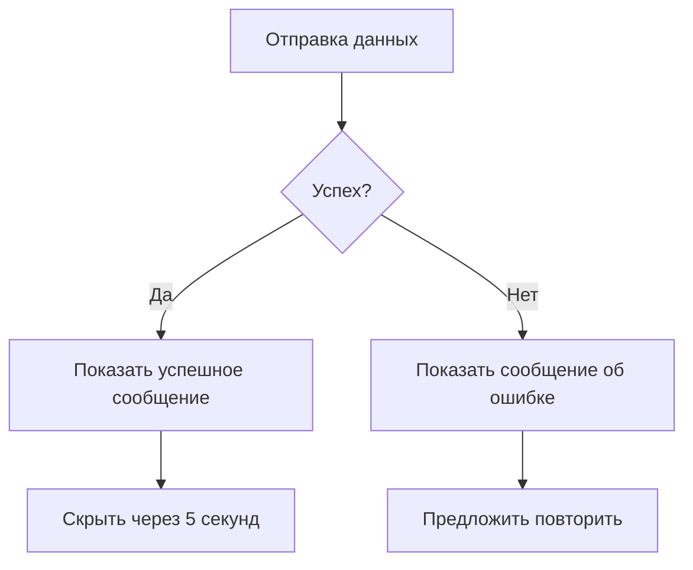

# Интерфейс статуса операции

## Компоненты интерфейса

### 1. Успешное сообщение
```
+-------------------------------------+
| ✓ Успех!                           |
+-------------------------------------+
|                                     |
| Показания успешно сохранены         |
|                                     |
| День: 123.45 кВт·ч                  |
| Ночь: 67.89 кВт·ч                   |
| Дата: 23.01.2026                    |
|                                     |
| [Закрыть]                          |
|                                     |
+-------------------------------------+
```

### 2. Сообщение об ошибке
```
+-------------------------------------+
| ✗ Ошибка!                           |
+-------------------------------------+
|                                     |
| Не удалось сохранить показания      |
|                                     |
| Причина:                            |
| - Поле "День" обязательно для      |
|   заполнения                        |
|                                     |
| [Попробовать снова]                 |
|                                     |
+-------------------------------------+
```

## Логика отображения



## Варианты статусов

1. **Успех**:
   - Зеленый фон
   - Иконка галочки
   - Автоматическое скрытие через 5 секунд

2. **Ошибка валидации**:
   - Красный фон
   - Иконка крестика
   - Список ошибок
   - Кнопка "Попробовать снова"

3. **Ошибка сервера**:
   - Красный фон
   - Иконка крестика
   - Сообщение "Ошибка сервера"
   - Кнопка "Попробовать позже"

## Примеры сообщений

### Успех
```json
{
    "type": "success",
    "title": "Успех!",
    "message": "Показания успешно сохранены",
    "data": {
        "day_reading": 123.45,
        "night_reading": 67.89,
        "date": "2026-01-23"
    }
}
```

### Ошибка
```json
{
    "type": "error",
    "title": "Ошибка!",
    "message": "Не удалось сохранить показания",
    "errors": [
        {
            "field": "day_reading",
            "message": "Поле обязательно для заполнения"
        }
    ]
}