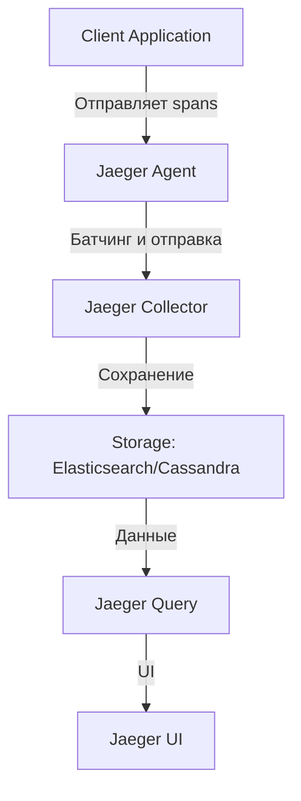

# Система телеметрии с Jaeger

## Обзор

Система телеметрии на основе Jaeger позволяет отслеживать запросы, выявлять узкие места и анализировать производительность приложения. Это особенно важно для микросервисной архитектуры и распределенных систем.

## Компоненты

### 1. Jaeger Architecture



### 2. Интеграция с FastAPI

```python
# app/telemetry.py
from opentelemetry import trace
from opentelemetry.sdk.trace import TracerProvider
from opentelemetry.sdk.trace.export import BatchSpanProcessor
from opentelemetry.exporter.jaeger.thrift import JaegerExporter
from opentelemetry.instrumentation.fastapi import FastAPIInstrumentor

def init_telemetry():
    """Initialize Jaeger telemetry."""
    
    # Настройка провайдера трейсов
    trace.set_tracer_provider(TracerProvider())
    
    # Настройка экспортера в Jaeger
    jaeger_exporter = JaegerExporter(
        agent_host_name='jaeger',
        agent_port=6831,
    )
    
    # Настройка обработчика spans
    trace.get_tracer_provider().add_span_processor(
        BatchSpanProcessor(jaeger_exporter)
    )
    
    # Инструментация FastAPI
    FastAPIInstrumentor.instrument()
```

## Конфигурация

### 1. Docker Compose

```yaml
# docker-compose.yml
version: '3'

services:
  jaeger:
    image: jaegertracing/all-in-one:latest
    ports:
      - "16686:16686"  # UI
      - "6831:6831"    # Agent
      - "6832:6832"    # Agent (UDP)
    environment:
      - COLLECTOR_ZIPKIN_HOST_PORT=:9411
    networks:
      - monitoring

  app:
    build: .
    ports:
      - "8000:8000"
    environment:
      - JAEGER_AGENT_HOST=jaeger
      - JAEGER_AGENT_PORT=6831
    depends_on:
      - jaeger
    networks:
      - monitoring

networks:
  monitoring:
    driver: bridge
```

### 2. Конфигурация приложения

```python
# app/core/settings.py
from pydantic import BaseSettings

class Settings(BaseSettings):
    # ... другие настройки ...
    
    # Настройки Jaeger
    jaeger_agent_host: str = "jaeger"
    jaeger_agent_port: int = 6831
    jaeger_service_name: str = "electro-app"
    
    class Config:
        env_file = ".env"
```

## Инструментация кода

### 1. Инструментация API маршрутов

```python
# app/rest_api/readings/endpoints.py
from fastapi import APIRouter, Depends
from opentelemetry import trace

router = APIRouter()

@router.post("/readings")
async def create_reading(
    reading: ReadingCreate,
    current_user: User = Depends(get_current_user)
):
    tracer = trace.get_tracer(__name__)
    
    with tracer.start_as_current_span("create_reading"):
        # Бизнес-логика
        return await reading_service.create_reading(reading, current_user)
```

### 2. Инструментация сервисного слоя

```python
# app/core/services/reading_service.py
from opentelemetry import trace

class ReadingService:
    def __init__(self, readings_repo: ReadingsRepository):
        self.readings_repo = readings_repo
    
    async def create_reading(self, reading_data: ReadingCreate, user: User):
        tracer = trace.get_tracer(__name__)
        
        with tracer.start_as_current_span("ReadingService.create_reading"):
            # Создание записи
            reading = Reading(
                user_id=user.id,
                day_reading=reading_data.day_reading,
                night_reading=reading_data.night_reading
            )
            
            await self.readings_repo.add(reading)
            
            return reading
```

### 3. Инструментация репозиториев

```python
# app/adapters/sqla/repositories/readings.py
from opentelemetry import trace

class SqlAlchemyReadingsRepository(ReadingsRepository):
    def __init__(self, session: AsyncSession):
        self.session = session
    
    async def add(self, reading: Reading):
        tracer = trace.get_tracer(__name__)
        
        with tracer.start_as_current_span("SqlAlchemyReadingsRepository.add"):
            self.session.add(reading)
```

## Метрики и теги

### 1. Стандартные теги

```python
from opentelemetry.trace import Status, StatusCode

with tracer.start_as_current_span("process_reading") as span:
    try:
        # Обработка
        span.set_attribute("user.id", str(user.id))
        span.set_attribute("reading.type", "electricity")
        span.set_attribute("reading.day", reading.day_reading)
        span.set_attribute("reading.night", reading.night_reading)
        
    except Exception as e:
        span.set_status(Status(StatusCode.ERROR))
        span.record_exception(e)
        raise
```

### 2. Кастомные метрики

```python
# app/telemetry.py
from opentelemetry.metrics import get_meter

meter = get_meter("electro_app")

# Счетчик успешных операций
successful_readings_counter = meter.create_counter(
    "readings.successful",
    description="Number of successful reading submissions"
)

# Счетчик ошибок
failed_readings_counter = meter.create_counter(
    "readings.failed",
    description="Number of failed reading submissions"
)

# Гистограмма времени обработки
processing_time_histogram = meter.create_histogram(
    "readings.processing_time",
    description="Time taken to process readings"
)
```

## Визуализация в Jaeger UI

### 1. Пример трейса

```
Trace ID: 1234567890abcdef1234567890abcdef
Span ID: 1234567890abcdef
Operation: POST /api/readings
Duration: 150ms

Tags:
- http.method: POST
- http.path: /api/readings
- http.status_code: 201
- user.id: 550e8400-e29b-41d4-a716-446655440000
- reading.day: 123.45
- reading.night: 67.89

Child Spans:
1. ReadingService.create_reading (100ms)
   - reading.validation: passed
   - reading.normalization: applied
   
2. SqlAlchemyReadingsRepository.add (40ms)
   - db.query: INSERT INTO readings...
   - db.rows_affected: 1
```

### 2. Анализ производительности

1. **Зависимости**: Визуализация цепочки вызовов между сервисами
2. **Узкие места**: Выявление медленных операций
3. **Ошибки**: Анализ неудачных запросов
4. **Тренды**: Мониторинг изменений производительности во времени

## Интеграция с существующей архитектурой

### 1. Middleware для телеметрии

```python
# app/rest_api/telemetry.py
from fastapi import Request
from opentelemetry import trace

class RequestTracingMiddleware:
    async def __call__(self, request: Request, call_next):
        tracer = trace.get_tracer(__name__)
        
        with tracer.start_as_current_span(
            f"{request.method} {request.url.path}",
            kind=trace.SpanKind.SERVER
        ) as span:
            span.set_attribute("http.method", request.method)
            span.set_attribute("http.path", request.url.path)
            span.set_attribute("http.user_agent", request.headers.get("user-agent"))
            
            try:
                response = await call_next(request)
                span.set_attribute("http.status_code", response.status_code)
                return response
            except Exception as e:
                span.set_status(Status(StatusCode.ERROR))
                span.record_exception(e)
                raise
```

### 2. Логирование с контекстом трейсинга

```python
# app/telemetry.py
import logging
from opentelemetry.trace import get_current_span

class TracingLogger:
    def __init__(self, name):
        self.logger = logging.getLogger(name)
    
    def info(self, message, **kwargs):
        span = get_current_span()
        if span.is_recording():
            kwargs["trace_id"] = format(span.get_span_context().trace_id, "032x")
            kwargs["span_id"] = format(span.get_span_context().span_id, "016x")
        
        self.logger.info(message, extra=kwargs)
```

## Преимущества

1. **Отладка**: Быстрое выявление причин ошибок
2. **Производительность**: Анализ времени ответа и узких мест
3. **Мониторинг**: Отслеживание здоровья системы в реальном времени
4. **Анализ**: Понимание потоков данных и зависимостей между сервисами
5. **Оптимизация**: Выявление возможностей для улучшения производительности

## Развертывание

1. Запуск Jaeger через Docker
2. Настройка конфигурации приложения
3. Инструментация ключевых компонентов
4. Настройка дашбордов в Jaeger UI
5. Интеграция с системами мониторинга (Prometheus, Grafana)